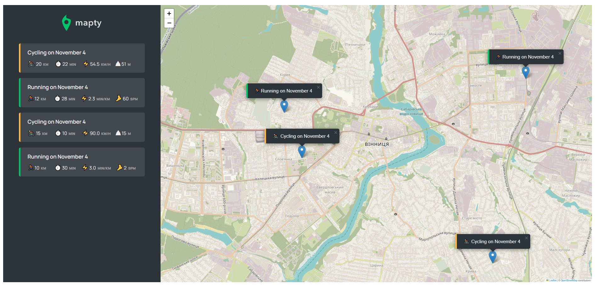

# <a href="https://mapty-workouts-andrii-mysaka.netlify.app" target="_blank">Mapty</a>
Mapty is a map application made with Vanilla JavaScript to store workouts like running and cycling.

The user can choose any point on the map and choose between running or cycling. In order to submit the workout, the user needs to fill out several details like distance, duration, cadence or elevation. All the workout will be saved after choosing any new workout option.
The user is able to find the workout on the map by clicking on the list. The list contains workout details like pace, cadence, duration, speed as well as the date of the workout.
If the user reloads the page, all the data will be saved.

### Project was made with:

- HTML
- CSS
- Vanilla JavaScript
- Leaflet API

# Hero

